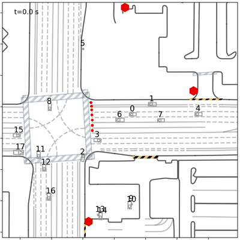
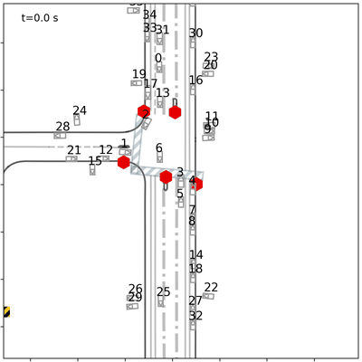
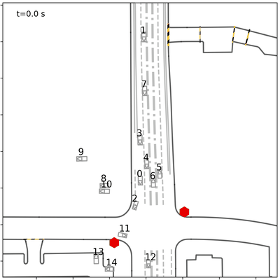
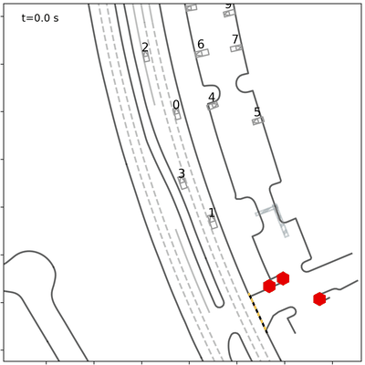

# CDPT — Causal Driving Pattern Transfer

This repository contains the source code for our **AAAI 2026** paper:

> [**Transferring Causal Driving Patterns for Generalizable Traffic Simulation with Diffusion-Based Distillation**](https://ojs.aaai.org/index.php/AAAI/article/view/36970)

<p align="center">
  <a href="https://nova-chen151.github.io/simCDPT.github.io/"></a>
  <a href="https://ojs.aaai.org/index.php/AAAI/article/view/36970"></a>
  <a href="https://doi.org/10.1609/aaai.v40i1.36970"></a>
</p>

**Authors:** [Yuhang Chen](https://tops.tongji.edu.cn/info/1204/2419.htm)<sup>1</sup>, [Jie Sun](https://tops.tongji.edu.cn/info/1031/1921.htm)<sup>1,†</sup>, [Jialin Fan](https://fantastic8124.github.io/)<sup>1</sup>, [Jian Sun](https://tops.tongji.edu.cn/info/1031/1187.htm)<sup>1</sup>

<sup>1</sup> College of Transportation & Key Laboratory of Road and Traffic Engineering of Ministry of Education, Tongji University, Shanghai, China  

---

## Qualitative demos

<p align="center">
  
  &nbsp;
  
  &nbsp;
  
  &nbsp;
  
</p>


---

## Build Enviroment

Clone the repo, then recreate our conda stack and install Waymax from Git plus this package in editable mode:

```bash
conda env create -n CDPT -f environment.yml
conda activate CDPT
pip install git+https://github.com/waymo-research/waymax.git@main#egg=waymo-waymax
pip install -e .
```

## Get Dataset (Waymo)

We experiment on the [Waymo Open Motion Dataset](https://waymo.com/open/data/motion/). For this codebase, use the **V1.2** release in **`tf_example`** form so Waymax I/O lines up with ours.

## Data Preparation

Convert downloads into the layout expected by training with:

```bash
python script/extract_data.py \
    --data_dir /path/to/waymo_open_motion_dataset_dir \
    --save_dir /path/to/data_save_dir \
    --num_workers 16 \
    --save_raw   # optional: keep Waymax-ready scenarios for viz
```

Run the extractor **once per split** (e.g. training vs. validation). Distillation: configure a teacher checkpoint in `config/CDPT.yaml`, or set `use_teacher: false` for student-only optimization.

## Training

```bash
python script/train.py --cfg config/CDPT.yaml --num_gpus 4
```

Tweak `CDPT.yaml` for local data roots, logging, and hyperparameters.

## Closed-loop evaluation

```bash
python script/test.py \
    --test_path /path/to/tf_example_data \
    --model_path /path/to/your.ckpt \
    --device cuda \
    --save_simulation
```

Point `--test_path` at your **`tf_example`** data; pass `--model_path` to a trained checkpoint (both are required).

## Acknowledgements

We thank the authors of [VBD](https://github.com/SafeRoboticsLab/VBD) and the [Waymax](https://github.com/waymo-research/waymax) team for open-sourcing foundations we built upon; cite their work if you reuse related components.

## Citation
If CDPT has been helpful in your research, please consider citing our work:

```bibtex
@inproceedings{chen2026transferring,
  title     = {Transferring Causal Driving Patterns for Generalizable Traffic Simulation with Diffusion-Based Distillation},
  author    = {Chen, Yuhang and Sun, Jie and Fan, Jialin and Sun, Jian},
  booktitle = {Proceedings of the AAAI Conference on Artificial Intelligence},
  volume    = {40},
  number    = {1},
  pages     = {110--118},
  year      = {2026},
  url       = {https://doi.org/10.1609/aaai.v40i1.36970}
}
```